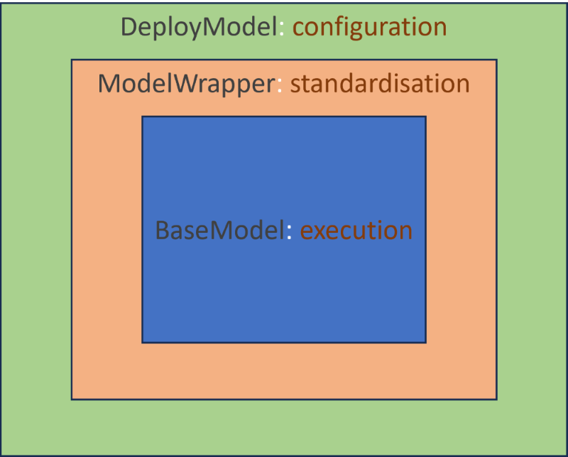

# Model Framework Description

## Table of Contents
1. [Repository Layout](#repository-layout)
2. [Model Wrapper Design](#model-wrapper-design)
   * [ModelWrapper Class](#modelwrapper-class)
   * [DeployWrapper Class](#deploywrapper-class)
3. [Model Design](#model-design)
   * [BaseModel Class](#basemodel-class)
4. [Deploy > Wrap > Model](#deploy--wrap--model)
   * [Deploy](#deploy)
   * [Wrap](#wrap)
   * [Model](#model)

## Repository Layout
* python-template/
  * config/
    * model_config/...
      * model_chains/...
      * model_metadata/...
  * data/...
  * documentation/...
    * resources/...
  * interface/
    * interface/...
    * run_chain/...
    * run_model/...
  * model_logs/...
  * src/
    * framework/
      * **model.py**
      * **model_wrapper.py**
      * setup/
    * models/
      * model_schemas/...
      * model_scripts/...
      model_wrappers/...
    * utils/...
  * tests/
    * data_reconciliation/
      * framework/...
    * pytests/...
  * venv/...

Throughout this document we will be focusing on the model_wrapper.py and 
model.py scripts, highlighted above in bold text.

## Model Wrapper Design
The script _model_wrapper.py_ contains two classes:
1. ModelWrapper
2. DeployWrapper

### ModelWrapper Class
This is a python abstract base class which will be used as the parent class (blueprint)
for all model wrapper classes.

This class handles the reading of data from disk to pandas/spark and the writing of pandas/spark
dataframes back to disk. This class currently supports read/write of .csv, .zip and .parquet file
types.

This class works with a model.BaseModel class type. The ModelWrapper class supplies the BaseModel class
the input data required in a standardised format, then after the BaseModel class has executed
the ModelWrapper class accepts the model outputs, checks for data type conformance.

This class contains 4 python abstract methods:
1. define_input_schemas
2. define_output_schemas
3. define_parameter_schemas
4. run_model

Abstract methods 1-3 are used during read/write of data to enforce data types to 
adhere to the defined schemas. Abstract method 4 is called to execute the model code
that has been wrapped.

### DeployWrapper Class
This class handles the execution of a model wrapper by supplying the required configuration
files for a particular model run. The benefit of this class is it allows the same ModelWrapper
class to be called for different configurations (i.e. different data, different parameters, chaining models) in a 
reusable and repeatable manner, in accordance to the SOLID principles of object orientated programming.

This class works with a ModelWrapper class type. The DeployWrapper class creates of the ModelWrapper class
by supplying the ModelWrapper class with a run specific configuration.

This class has 3 main functionalities: 
1. Handling model configuration
2. Configuring model logs
3. Passing model parameters

More generally the above 3 functionalities can all be defined under the theme "handling model configuration",
which is why they have been grouped together in the DeployModel class.

## Model Design
The script _model.py_ only contains 1 class:
1. BaseModel

### BaseModel Class
This is a python abstract base class which will be used as the parent class 
for all model classes containing model code.

The subclasses of the BaseModel class carry out the desired action of 
the model and can be considered as the engine of repository's model framework.

The usual action of this class is to receive standardised data, act on the data, and 
return an augmented dataset(s). The more generalised the code within this class
the more useful the model.

This class has 2 main functionalities.
1. Execute the desired model behaviour
2. Load model parameters to class instance variables.

Model parameters are loaded in from datasets or config files as class instance
variables to allow the lightweight access/passing of parameters between classes and scripts.

## Deploy > Wrap > Model
This defines a way of working within this repository. 

## Deploy
First we handle the way in which we want to deploy our model, this is the most 
granular level of model specification. This about how the model configuration 
should talk to the model wrapper to allow for re-use of the model wrapper.

## Wrap
The next step is creating a model wrapper to deploy. The reason we do this before 
we have written the model code is because it helps enforce a generalise way of thinking
when writing the model code. It also means we can test the model code within the repository's 
model framework as we develop.

## Model
Finally, we can write the model code. As we mentioned earlier this is where the action happens.
As we write the model code bear in mind future usage of the model, consider how to allow the usage
of different configurations or input datasets.

# Framework Diagram
The below diagram shows visually the model framework encapsulates specific steps in the model
execution process. All models built with these abstract classes will inherit the same desired 
behaviour. Google "The 5 Principles of OOP" for more information.

